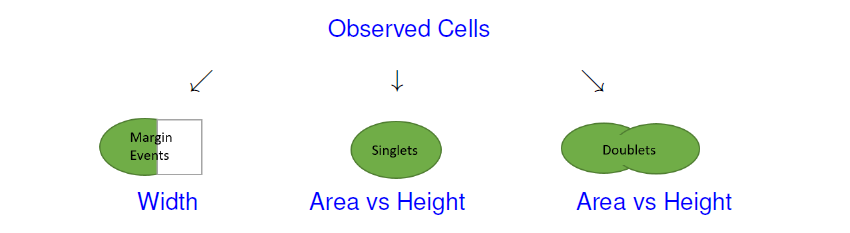

# cyanoFilter

[](https://travis-ci.org/fomotis/cyanoFilter)

```{r setup, include=FALSE, echo=FALSE}
library(tidyverse)
knitr::opts_chunk$set(echo = TRUE, collapse = TRUE, comment = ">",
                      warning = FALSE, 
                      message = FALSE, 
                      cache = TRUE,
                      fig.path = "man/figures/README-")
```

cyaoFilter is a package designed to identify, assign indicators and/or filter out synechoccus type cyanobacteria from a water sample examined with flowcytometry.

# Installation and Dependencies

Run the `code` below to install the package and all its dependencies.

```{r cran-installation2, eval=FALSE}
install.packages("cyanoFilter")
```

All dependencies both on **CRAN** and **bioconductor** should be installed when you install the package itself. However, do install the following needed **bioconductor** packages should you run into errors while attempting to use the functions in this package.

```{r cran-installation, eval=FALSE}
install.packages("BiocManager")
library(BiocManager)
install(c("Biobase", "flowCore", "flowDensity"))
```


# Motivation and Background

Flow cytometry is a well-known technique for identifying cell populations in fluids. It is largely applied in biological and medical sciences for cell sorting, counting, biomarker detections and protein engineering.  Identifying cell populations in flow cytometry data often rely on manual gating, a subjective and generally irreproducible method based on expert knowledge. To address this issue, two filtering frameworks were developed in **R**, identifying and filtering out two strains of Synechococcus type cyanobacteria (*BS4* and *BS5*) from flow cytometry data. 

# Usage

The package comes with 2 internal datasets that is used for demonstrating the usage of the functions contained in the package. The **meta data** file contains *BS4* and *BS5* samples examined with a GUAVAVA flow cytometer at 3 dilution levels (*2000*, *10000* and *20000*) each. The **FCS** file contains the flow cytometer channel measurements for one of these sample.

## Meta File Preprocessing

### The Good Measurements 

`goodfcs()` is deigned to check the cells/$\mu$L of the meta file (normally csv) obtained from the flow cytometer and decide if the measurements in the FCS file can be trusted. 

```{r the_csvs}
#internally contained datafile in cyanoFilter
metadata <- system.file("extdata", "2019-03-25_Rstarted.csv", package = "cyanoFilter",
               mustWork = TRUE)
metafile <- read.csv(metadata, skip = 7, stringsAsFactors = FALSE, check.names = TRUE)
metafile <- metafile[, 1:65] #first 65 columns contains useful information
#extract the part of the Sample.ID that corresponds to BS4 or BS5
metafile$Sample.ID2 <- stringr::str_extract(metafile$Sample.ID, "BS*[4-5]")
#clean up the Cells.muL column
names(metafile)[which(stringr::str_detect(names(metafile), "Cells."))] <- "CellspML"
metafile$Status <- cyanoFilter::goodfcs(metafile = metafile, col_cpml = "CellspML", 
                                        mxd_cellpML = 1000, mnd_cellpML = 50)
#should work fine with tidyverse setup
metafile <- metafile %>% mutate(Status = cyanoFilter::goodfcs(metafile = metafile, col_cpml = 
                                                                "CellspML", mxd_cellpML = 1000,
                                                              mnd_cellpML = 50))
#the whole metadata file
knitr::kable(metafile)
#some interesting columns and the newly added column
knitr::kable(metafile %>% 
              dplyr::select(Sample.ID, Sample.ID2, Number.of.Events, Dilution.Factor, CellspML, Status) )
```


The **Status** columns indicates if the file at the current dilution level is good.

### Files to Retain

Generally, reading **FCS** files with the `read.FCS()` function from the `flowCore` package takes time, hence it can save you considerable amount of time to read only the good files. An **FCS** normally contains data from many experiment or same experiment measured at different dilution levels. Some of these would be determined bad by the `goodfcs()` function and should be avoided. The `retain()` function is especially designed for this.

Since each sample, i.e. *BS4* and *BS5* were measured at 3 dilution levels it means that the 3 rows in *metafile* containing the measurements of *BS4* are to be examined together by the `retain()` function and the same should be done for the *BS5* dilution levels. This can easily be achieved by using some `tidyverse` function to break the *metafile* into two based on *Sample.ID2* and apply `retain()` on the broken dataset.  


```{r the_csvs2}
#break csv file into groups (2 in this case) based on sample ID2
broken <- metafile %>% group_by(Sample.ID2) %>% nest() 
#this is how broken looks like
broken

# Let's apply the function
metafile$Retained <- unlist(map(broken$data, function(.x) {
    cyanoFilter::retain(meta_files = .x, make_decision = "maxi",
                      Status = "Status", 
                      CellspML = "CellspML")
  })
)  
#the whole metadata file
knitr::kable(metafile)
#some interesting column
knitr::kable(metafile %>% 
              dplyr::select(Sample.ID, Sample.ID2, Number.of.Events, Dilution.Factor, CellspML, Status, Retained) )
```

Notice that the function suggests you retain only the measurements associated with dilution *2000* since *make_decision = "maxi"* and diltion *2000* happens to have the highest cells/$\mu$L measurement among the dilution levels for both *BS4* and *BS5*. Furthermore, rather than reading in 6 files, we have narrowed down to reading only the 2 needed files.

## Flow Cytometer File Processing

### Removing NAs in Expression Matrix

`nona()` functions removes `NA` values from the inputed flowframe.

```{r nona}
flowfile_path <- system.file("extdata", "text.fcs", package = "cyanoFilter",
                              mustWork = TRUE)
flowfile <- flowCore::read.FCS(flowfile_path, alter.names = TRUE,
                               transformation = FALSE, emptyValue = FALSE,
                               dataset = 1) #FCS file contains only one data object
flowfile_nona <- cyanoFilter::nona(x = flowfile)
```

### Removing Negative Values in Expression Matrix

Typically negative values are removed from the expression matrix as they are deemed measurement error (there are some arguments against this) so the `noneg()` rids a flowframe of all negative values in its expression matrix.

```{r noneg}
flowfile_noneg <- cyanoFilter::noneg(x = flowfile_nona)
```


### Log-Transforming Expression Matrix

`lnTrans()` transforms all values (except those specified in the *notToTransform* option) in an expression matrix to the log scale. This function has a counterpart in the `flowCore()` package but we made things simpler and also give the opportunity for users to specify columns in the flowframe that are not to be transformed.

```{r logtrans}
flowfile_logtrans <- cyanoFilter::lnTrans(x = flowfile_noneg, notToTransform = c("SSC.W", "TIME"))
```

### Plotting

pair_plot() gives a scatter plot of all columns in the flowframe, except that specified in the *notToPlot* option. 

```{r plotting}
cyanoFilter::pair_plot(flowfile_noneg, notToPlot = "TIME") ##untransfrmed
cyanoFilter::pair_plot(flowfile_logtrans, notToPlot = "TIME") ##logtransformed

```

## Clustering and Gating

Flow cytometry outcomes can be divided into 3 and they are not entirely mutually exclusive but this is normally not a problem as scientists are normally interested in a pre-defined outcome.



- Margin Events are particles too big to be measured
- Doublets are cells with disproportionate Area, Height relationship
- Singlets are the 'normal cells' but these could either be dead cells/particles (debris) and living (good cells).

The set of functions below identifies margin events and singlets. Doublets are normally pre-filtered during the event acquiring phase in a flow cytometer, especially in new models.

### Margin Events

Margin Events are particles that are too large for teh flow cytometer to measure. It is desired to eliminate this particles or assign indicators to them in the flow frame to allow its identification. The `cellmargin()` function achieves this. It returns a list containing; 

- *fullflowframe* with indicator for margin and non-margin events in th eexpression matrix, 
- *reducedflowframe* containing only non-margin events
- *N_margin* number of margin events contained in the input flowframe
- *N_nonmargin* number of non-margin events
- *N_particle* number of particles in the input flowframe

```{r marginEvents, cache=TRUE}
flowfile_marginout <- cyanoFilter::cellmargin(flow.frame = flowfile_logtrans, Channel = 'SSC.W',
                                              type = 'estimate', y_toplot = "FSC.HLin")
```


We conceptualized the division of cells into clusters in two ways in cyanoFilter and this is reflected in two main functions that perform the clustering exercise; `celldebris_nc()` and `celldebris_emclustering()`. The `celldebris_nc()` function employs minimum intersection points between peaks in observed in a two dimensional kernel density estimate while `celldebris_emclustering()` employs an EM algorithm which uses a mixture of multivariate normals to assign probabilities to each cell belonging to a cluster. Behind the scenes, `celldebris_nc()` calls the `deGate()` in **flowDensity** package to estimate the intersection point between peaks and `celldebris_emclustering()` calls an internal `mvnorm()` function for the multivariate normals. Both functions produce plots by default to enable users access the results. 

### cyanobacteria Population Identification (Kernel Density Approach using flowDensity)


```{r kdapproach, cache=TRUE}

cyanoFilter::celldebris_nc(flowfile_marginout$reducedflowframe, channel1 = "RED.B.HLin",
                    channel2 = "YEL.B.HLin", interest = "BS4", to_retain = "refined" )
```

Here, we demonstrate the use of the `celldebris_nc()` function on the result from filtering out of margin events. The dashed red lines in the plot shows the intersection points estimated and the circle comes from the fact that *to_retain* option was set to refined *refined*. This option forces the algorithm to retain only cells that are not more than 1 standard deviations away from the center. If *to_retain* is set to refined *potential*, then all points in the desired section of the 4 sections resulting from the partitions are retained. The functions returns a list containing; a fullflowframe with added column for indicators for each cell type, a reduced flowframe with only *interest* cells retained, cell count and debris counts.

### cyanobacteria Population Identification (EM Approach)


```{r emapproach, cache=TRUE}

cyanoFilter::celldebris_emclustering(flowfile_marginout$reducedflowframe, channels =  c("RED.B.HLin",
                    "YEL.B.HLin", "FSC.HLin", "RED.R.HLin"), ncluster = 4, min.itera = 20)
```

Here, we demonstrate the `celldebris_emclustering()` function on the result from filtering out of margin events. The red texts in the plot shows the center of each cluster and the boundaries of the cluster with the largest weight is plotted. It is quite difficult to vizualise 5-dimensional clustering in two dimensions hence this option. The function returns a list containing; matrix of means, list of variance-covariance matrices and a flowframe with added columns for the cluster probabilities in the expression matrix.

# License

This is a free to use package for anyone who has the need.


