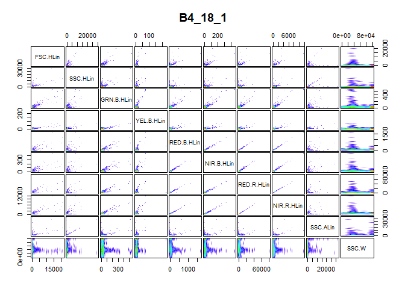
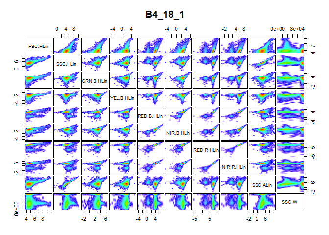
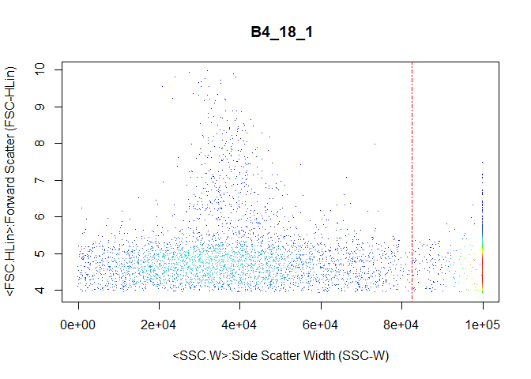

# cyanoFilter

[](https://travis-ci.org/fomotis/cyanoFilter)

cyaoFilter is a package designed to identify, assign indicators and/or
filter out synechoccus type cyanobacteria from a water sample examined
with flowcytometry.

# Installation and Dependencies

Run the `code` below to install the package and all its dependencies.

``` r
install.packages("cyanoFilter")
```

All dependencies both on **CRAN** and **bioconductor** should be
installed when you install the package itself. However, do install the
following needed **bioconductor** packages should you run into errors
while attempting to use the functions in this package.

``` r
install.packages("BiocManager")
library(BiocManager)
install(c("Biobase", "flowCore", "flowDensity"))
```

# Motivation and Background

Flow cytometry is a well-known technique for identifying cell
populations in fluids. It is largely applied in biological and medical
sciences for cell sorting, counting, biomarker detections and protein
engineering. Identifying cell populations in flow cytometry data often
rely on manual gating, a subjective and generally irreproducible method
based on expert knowledge. To address this issue, two filtering
frameworks were developed in **R**, identifying and filtering out two
strains of Synechococcus type cyanobacteria (*BS4* and *BS5*) from flow
cytometry data.

# Usage

The package comes with 2 internal datasets that is used for
demonstrating the usage of the functions contained in the package. The
**meta data** file contains *BS4* and *BS5* samples examined with a
GUAVAVA flow cytometer at 3 dilution levels (*2000*, *10000* and
*20000*) each. The **FCS** file contains the flow cytometer channel
measurements for one of these sample.

## Meta File Preprocessing

### The Good Measurements

`goodfcs()` is deigned to check the cells/\(\mu\)L of the meta file
(normally csv) obtained from the flow cytometer and decide if the
measurements in the FCS file can be trusted.

``` r
#internally contained datafile in cyanoFilter
metadata <- system.file("extdata", "2019-03-25_Rstarted.csv", package = "cyanoFilter",
               mustWork = TRUE)
metafile <- read.csv(metadata, skip = 7, stringsAsFactors = FALSE, check.names = TRUE)
metafile <- metafile[, 1:65] #first 65 columns contains useful information
#extract the part of the Sample.ID that corresponds to BS4 or BS5
metafile$Sample.ID2 <- stringr::str_extract(metafile$Sample.ID, "BS*[4-5]")
#clean up the Cells.muL column
names(metafile)[which(stringr::str_detect(names(metafile), "Cells."))] <- "CellspML"
metafile$Status <- cyanoFilter::goodfcs(metafile = metafile, col_cpml = "CellspML", 
                                        mxd_cellpML = 1000, mnd_cellpML = 50)
#should work fine with tidyverse setup
metafile <- metafile %>% mutate(Status = cyanoFilter::goodfcs(metafile = metafile, col_cpml = 
                                                                "CellspML", mxd_cellpML = 1000,
                                                              mnd_cellpML = 50))
knitr::kable(metafile)
```

| Sample.Number | Sample.ID  | Number.of.Events | Termination.Count | Count.Gate | Dilution.Factor | Original.Volume |  CellspML | Total.Volume..µL. | Acquisition.Time..s. | Date.of.Acquisition | Time.of.Acquisition | FSC.Gain | SSC |    GRN.B |    YEL.B | RED.B | NIR.B | RED.R | NIR.R | SSC.1 | GRN.B.1 | YEL.B.1 | RED.B.1 | NIR.B.1 | RED.R.1 | NIR.R.1 | YEL.B….GRN.B | RED.B….GRN.B | NIR.B….GRN.B | RED.R….GRN.B | NIR.R….GRN.B | GRN.B….YEL.B | RED.B….YEL.B | NIR.B….YEL.B | RED.R….YEL.B | NIR.R….YEL.B | GRN.B….RED.B | YEL.B….RED.B | NIR.B….RED.B | RED.R….RED.B | NIR.R….RED.B | GRN.B….NIR.B | YEL.B….NIR.B | RED.B….NIR.B | RED.R….NIR.B | NIR.R….NIR.B | GRN.B….RED.R | YEL.B….RED.R | RED.B….RED.R | NIR.B….RED.R | NIR.R….RED.R | GRN.B….NIR.R | YEL.B….NIR.R | RED.B….NIR.R | NIR.B….NIR.R | RED.R….NIR.R | Threshold.Parameter | Threshold.Value | Flow.Rate..µL.s. | High.Concentration.Warning.Trigger | X..of.Errors…Warnings | User.Login.Name | User.Full.Name | WorkList                                                           | Sample.ID2 | Status |
| ------------: | :--------- | ---------------: | ----------------: | :--------- | --------------: | --------------: | --------: | ----------------: | -------------------: | :------------------ | :------------------ | -------: | --: | -------: | -------: | ----: | ----: | ----: | ----: | :---- | :------ | :------ | :------ | :------ | :------ | :------ | :----------- | :----------- | :----------- | :----------- | :----------- | :----------- | :----------- | :----------- | :----------- | :----------- | :----------- | :----------- | :----------- | :----------- | :----------- | :----------- | :----------- | :----------- | :----------- | :----------- | :----------- | :----------- | :----------- | :----------- | :----------- | :----------- | :----------- | :----------- | :----------- | :----------- | :------------------ | --------------: | ---------------: | ---------------------------------: | --------------------: | :-------------- | :------------- | :----------------------------------------------------------------- | :--------- | :----- |
|             1 | BS4\_20000 |             6918 |              5000 | Cyanos     |           20000 |              10 |  62.02270 |         111.53980 |            189.05051 | 25-MAR-2019         | 12:42:13            | 10.37472 |   1 | 9.934862 | 3.084422 |     1 |     1 |     1 |     1 | Yes   | Yes     | Yes     | Yes     | Yes     | Yes     | Yes     | —            | —            | —            | —            | —            | —            | —            | —            | —            | —            | —            | —            | —            | —            | —            | —            | —            | —            | —            | —            | —            | —            | —            | —            | —            | —            | —            | —            | —            | —            | FSC                 |              50 |             0.59 |                                500 |                     1 | DESKTOP-9MNKV60 | Unknown        | C:/Users/User/Documents/Backup data/2019-03-25\_at\_12-37-08pm.xml | BS4        | good   |
|             2 | BS4\_10000 |             6591 |              5000 | Cyanos     |           10000 |              10 | 116.76311 |          56.44762 |             95.67394 | 25-MAR-2019         | 12:44:25            | 10.37472 |   1 | 9.934862 | 3.084422 |     1 |     1 |     1 |     1 | Yes   | Yes     | Yes     | Yes     | Yes     | Yes     | Yes     | —            | —            | —            | —            | —            | —            | —            | —            | —            | —            | —            | —            | —            | —            | —            | —            | —            | —            | —            | —            | —            | —            | —            | —            | —            | —            | —            | —            | —            | —            | FSC                 |              50 |             0.59 |                                500 |                     1 | DESKTOP-9MNKV60 | Unknown        | C:/Users/User/Documents/Backup data/2019-03-25\_at\_12-37-08pm.xml | BS4        | good   |
|             3 | BS4\_2000  |             6508 |              5000 | Cyanos     |            2000 |              10 | 517.90008 |          12.56613 |             21.29853 | 25-MAR-2019         | 12:45:19            | 10.37472 |   1 | 9.934862 | 3.084422 |     1 |     1 |     1 |     1 | Yes   | Yes     | Yes     | Yes     | Yes     | Yes     | Yes     | —            | —            | —            | —            | —            | —            | —            | —            | —            | —            | —            | —            | —            | —            | —            | —            | —            | —            | —            | —            | —            | —            | —            | —            | —            | —            | —            | —            | —            | —            | FSC                 |              50 |             0.59 |                                500 |                     2 | DESKTOP-9MNKV60 | Unknown        | C:/Users/User/Documents/Backup data/2019-03-25\_at\_12-37-08pm.xml | BS4        | good   |
|             4 | BS5\_20000 |             5976 |              5000 | Cyanos     |           20000 |              10 |  48.31036 |         123.70018 |            209.66132 | 25-MAR-2019         | 12:49:22            | 10.37472 |   1 | 9.934862 | 3.084422 |     1 |     1 |     1 |     1 | Yes   | Yes     | Yes     | Yes     | Yes     | Yes     | Yes     | —            | —            | —            | —            | —            | —            | —            | —            | —            | —            | —            | —            | —            | —            | —            | —            | —            | —            | —            | —            | —            | —            | —            | —            | —            | —            | —            | —            | —            | —            | FSC                 |              50 |             0.59 |                                500 |                     2 | DESKTOP-9MNKV60 | Unknown        | C:/Users/User/Documents/Backup data/2019-03-25\_at\_12-37-08pm.xml | BS5        | bad    |
|             5 | BS5\_10000 |             5844 |              5000 | Cyanos     |           10000 |              10 |  90.51666 |          64.56270 |            109.42831 | 25-MAR-2019         | 12:51:49            | 10.37472 |   1 | 9.934862 | 3.084422 |     1 |     1 |     1 |     1 | Yes   | Yes     | Yes     | Yes     | Yes     | Yes     | Yes     | —            | —            | —            | —            | —            | —            | —            | —            | —            | —            | —            | —            | —            | —            | —            | —            | —            | —            | —            | —            | —            | —            | —            | —            | —            | —            | —            | —            | —            | —            | FSC                 |              50 |             0.59 |                                500 |                     1 | DESKTOP-9MNKV60 | Unknown        | C:/Users/User/Documents/Backup data/2019-03-25\_at\_12-37-08pm.xml | BS5        | good   |
|             6 | BS5\_2000  |             5829 |              5000 | Cyanos     |            2000 |              10 | 400.72498 |          14.54614 |             24.65447 | 25-MAR-2019         | 12:52:47            | 10.37472 |   1 | 9.934862 | 3.084422 |     1 |     1 |     1 |     1 | Yes   | Yes     | Yes     | Yes     | Yes     | Yes     | Yes     | —            | —            | —            | —            | —            | —            | —            | —            | —            | —            | —            | —            | —            | —            | —            | —            | —            | —            | —            | —            | —            | —            | —            | —            | —            | —            | —            | —            | —            | —            | FSC                 |              50 |             0.59 |                                500 |                     1 | DESKTOP-9MNKV60 | Unknown        | C:/Users/User/Documents/Backup data/2019-03-25\_at\_12-37-08pm.xml | BS5        | good   |

### Files to Retain

Generally, reading **FCS** files with the `read.FCS()` function from the
`flowCore` package takes time, hence it can save you considerable amount
of time to read only the good files. An **FCS** normally contains data
from many experiment or same experiment measured at different dilution
levels. Some of these would be determined bad by the `goodfcs()`
function and should be avoided. The `retain()` function is especially
designed for this.

Since each sample, i.e. *BS4* and *BS5* were measured at 3 dilution
levels it means that the 3 rows in *metafile* containing the
measurements of *BS4* are to be examined together by the `retain()`
function and the same should be done for the *BS5* dilution levels. This
can easily be achieved by using some `tidyverse` function to break the
*metafile* into two based on *Sample.ID2* and apply `retain()` on the
broken dataset.

``` r
#break csv file into groups (2 in this case) based on sample ID2
broken <- metafile %>% group_by(Sample.ID2) %>% nest() 
#this is how broken looks like
broken
> # A tibble: 2 x 2
>   Sample.ID2 data             
>   <chr>      <list>           
> 1 BS4        <tibble [3 x 66]>
> 2 BS5        <tibble [3 x 66]>

# Let's apply the function
metafile$Retained <- unlist(map(broken$data, function(.x) {
    cyanoFilter::retain(meta_files = .x, make_decision = "maxi",
                      Status = "Status", 
                      CellspML = "CellspML")
  })
)  

knitr::kable(metafile)
```

| Sample.Number | Sample.ID  | Number.of.Events | Termination.Count | Count.Gate | Dilution.Factor | Original.Volume |  CellspML | Total.Volume..µL. | Acquisition.Time..s. | Date.of.Acquisition | Time.of.Acquisition | FSC.Gain | SSC |    GRN.B |    YEL.B | RED.B | NIR.B | RED.R | NIR.R | SSC.1 | GRN.B.1 | YEL.B.1 | RED.B.1 | NIR.B.1 | RED.R.1 | NIR.R.1 | YEL.B….GRN.B | RED.B….GRN.B | NIR.B….GRN.B | RED.R….GRN.B | NIR.R….GRN.B | GRN.B….YEL.B | RED.B….YEL.B | NIR.B….YEL.B | RED.R….YEL.B | NIR.R….YEL.B | GRN.B….RED.B | YEL.B….RED.B | NIR.B….RED.B | RED.R….RED.B | NIR.R….RED.B | GRN.B….NIR.B | YEL.B….NIR.B | RED.B….NIR.B | RED.R….NIR.B | NIR.R….NIR.B | GRN.B….RED.R | YEL.B….RED.R | RED.B….RED.R | NIR.B….RED.R | NIR.R….RED.R | GRN.B….NIR.R | YEL.B….NIR.R | RED.B….NIR.R | NIR.B….NIR.R | RED.R….NIR.R | Threshold.Parameter | Threshold.Value | Flow.Rate..µL.s. | High.Concentration.Warning.Trigger | X..of.Errors…Warnings | User.Login.Name | User.Full.Name | WorkList                                                           | Sample.ID2 | Status | Retained |
| ------------: | :--------- | ---------------: | ----------------: | :--------- | --------------: | --------------: | --------: | ----------------: | -------------------: | :------------------ | :------------------ | -------: | --: | -------: | -------: | ----: | ----: | ----: | ----: | :---- | :------ | :------ | :------ | :------ | :------ | :------ | :----------- | :----------- | :----------- | :----------- | :----------- | :----------- | :----------- | :----------- | :----------- | :----------- | :----------- | :----------- | :----------- | :----------- | :----------- | :----------- | :----------- | :----------- | :----------- | :----------- | :----------- | :----------- | :----------- | :----------- | :----------- | :----------- | :----------- | :----------- | :----------- | :----------- | :------------------ | --------------: | ---------------: | ---------------------------------: | --------------------: | :-------------- | :------------- | :----------------------------------------------------------------- | :--------- | :----- | :------- |
|             1 | BS4\_20000 |             6918 |              5000 | Cyanos     |           20000 |              10 |  62.02270 |         111.53980 |            189.05051 | 25-MAR-2019         | 12:42:13            | 10.37472 |   1 | 9.934862 | 3.084422 |     1 |     1 |     1 |     1 | Yes   | Yes     | Yes     | Yes     | Yes     | Yes     | Yes     | —            | —            | —            | —            | —            | —            | —            | —            | —            | —            | —            | —            | —            | —            | —            | —            | —            | —            | —            | —            | —            | —            | —            | —            | —            | —            | —            | —            | —            | —            | FSC                 |              50 |             0.59 |                                500 |                     1 | DESKTOP-9MNKV60 | Unknown        | C:/Users/User/Documents/Backup data/2019-03-25\_at\_12-37-08pm.xml | BS4        | good   | No\!     |
|             2 | BS4\_10000 |             6591 |              5000 | Cyanos     |           10000 |              10 | 116.76311 |          56.44762 |             95.67394 | 25-MAR-2019         | 12:44:25            | 10.37472 |   1 | 9.934862 | 3.084422 |     1 |     1 |     1 |     1 | Yes   | Yes     | Yes     | Yes     | Yes     | Yes     | Yes     | —            | —            | —            | —            | —            | —            | —            | —            | —            | —            | —            | —            | —            | —            | —            | —            | —            | —            | —            | —            | —            | —            | —            | —            | —            | —            | —            | —            | —            | —            | FSC                 |              50 |             0.59 |                                500 |                     1 | DESKTOP-9MNKV60 | Unknown        | C:/Users/User/Documents/Backup data/2019-03-25\_at\_12-37-08pm.xml | BS4        | good   | No\!     |
|             3 | BS4\_2000  |             6508 |              5000 | Cyanos     |            2000 |              10 | 517.90008 |          12.56613 |             21.29853 | 25-MAR-2019         | 12:45:19            | 10.37472 |   1 | 9.934862 | 3.084422 |     1 |     1 |     1 |     1 | Yes   | Yes     | Yes     | Yes     | Yes     | Yes     | Yes     | —            | —            | —            | —            | —            | —            | —            | —            | —            | —            | —            | —            | —            | —            | —            | —            | —            | —            | —            | —            | —            | —            | —            | —            | —            | —            | —            | —            | —            | —            | FSC                 |              50 |             0.59 |                                500 |                     2 | DESKTOP-9MNKV60 | Unknown        | C:/Users/User/Documents/Backup data/2019-03-25\_at\_12-37-08pm.xml | BS4        | good   | Retain   |
|             4 | BS5\_20000 |             5976 |              5000 | Cyanos     |           20000 |              10 |  48.31036 |         123.70018 |            209.66132 | 25-MAR-2019         | 12:49:22            | 10.37472 |   1 | 9.934862 | 3.084422 |     1 |     1 |     1 |     1 | Yes   | Yes     | Yes     | Yes     | Yes     | Yes     | Yes     | —            | —            | —            | —            | —            | —            | —            | —            | —            | —            | —            | —            | —            | —            | —            | —            | —            | —            | —            | —            | —            | —            | —            | —            | —            | —            | —            | —            | —            | —            | FSC                 |              50 |             0.59 |                                500 |                     2 | DESKTOP-9MNKV60 | Unknown        | C:/Users/User/Documents/Backup data/2019-03-25\_at\_12-37-08pm.xml | BS5        | bad    | No\!     |
|             5 | BS5\_10000 |             5844 |              5000 | Cyanos     |           10000 |              10 |  90.51666 |          64.56270 |            109.42831 | 25-MAR-2019         | 12:51:49            | 10.37472 |   1 | 9.934862 | 3.084422 |     1 |     1 |     1 |     1 | Yes   | Yes     | Yes     | Yes     | Yes     | Yes     | Yes     | —            | —            | —            | —            | —            | —            | —            | —            | —            | —            | —            | —            | —            | —            | —            | —            | —            | —            | —            | —            | —            | —            | —            | —            | —            | —            | —            | —            | —            | —            | FSC                 |              50 |             0.59 |                                500 |                     1 | DESKTOP-9MNKV60 | Unknown        | C:/Users/User/Documents/Backup data/2019-03-25\_at\_12-37-08pm.xml | BS5        | good   | No\!     |
|             6 | BS5\_2000  |             5829 |              5000 | Cyanos     |            2000 |              10 | 400.72498 |          14.54614 |             24.65447 | 25-MAR-2019         | 12:52:47            | 10.37472 |   1 | 9.934862 | 3.084422 |     1 |     1 |     1 |     1 | Yes   | Yes     | Yes     | Yes     | Yes     | Yes     | Yes     | —            | —            | —            | —            | —            | —            | —            | —            | —            | —            | —            | —            | —            | —            | —            | —            | —            | —            | —            | —            | —            | —            | —            | —            | —            | —            | —            | —            | —            | —            | FSC                 |              50 |             0.59 |                                500 |                     1 | DESKTOP-9MNKV60 | Unknown        | C:/Users/User/Documents/Backup data/2019-03-25\_at\_12-37-08pm.xml | BS5        | good   | Retain   |

Notice that the function suggests you retain only the measurements
associated with dilution *2000* since *make\_decision = “maxi”* and
diltion *2000* happens to have the highest cells/\(\mu\)L measurement
among the dilution levels for both *BS4* and *BS5*. Furthermore, rather
than reading in 6 files, we have narrowed down to reading only the 2
needed
files.

## Flow Cytometer File Processing

### Removing NAs in Expression Matrix

``` r
flowfile_path <- system.file("extdata", "text.fcs", package = "cyanoFilter",
                              mustWork = TRUE)
flowfile <- flowCore::read.FCS(flowfile_path, alter.names = TRUE,
                               transformation = FALSE, emptyValue = FALSE,
                               dataset = 1) #FCS file contains only one data object
flowfile_nona <- cyanoFilter::nona(x = flowfile)
```

### Removing Negative Values in Expression Matrix

``` r
flowfile_noneg <- cyanoFilter::noneg(x = flowfile_nona)
```

### Log-Transforming Expression Matrix

``` r
flowfile_logtrans <- cyanoFilter::lnTrans(x = flowfile_noneg, notToTransform = c("SSC.W", "TIME"))
```

### Plotting

``` r
cyanoFilter::pair_plot(flowfile_noneg, notToPlot = "TIME") ##untransfrmed
```

<!-- -->

``` r
cyanoFilter::pair_plot(flowfile_logtrans, notToPlot = "TIME") ##logtransformed
```

<!-- -->

## Clustering and Gating

### Margin Events

``` r
flowfile_marginout <- cyanoFilter::cellmargin(flow.frame = flowfile_logtrans, Channel = 'SSC.W', type = 'estimate', y_toplot = "FSC.HLin")
```

<!-- -->

# License

This is a free to use package for anyone who has the need.
